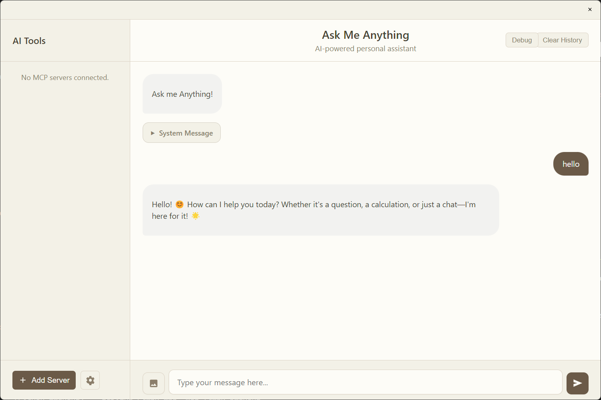
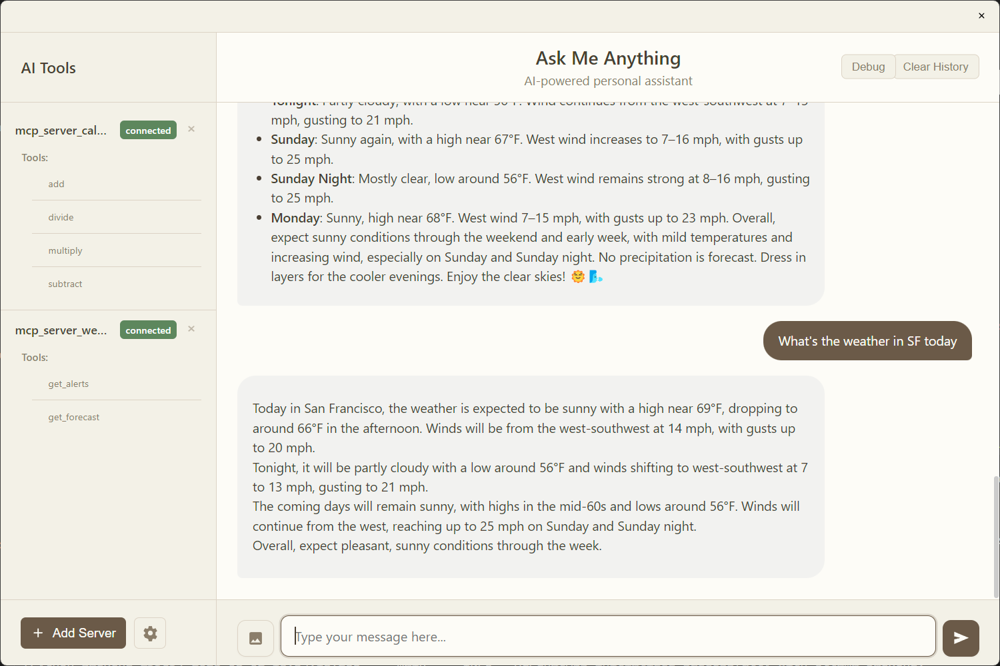
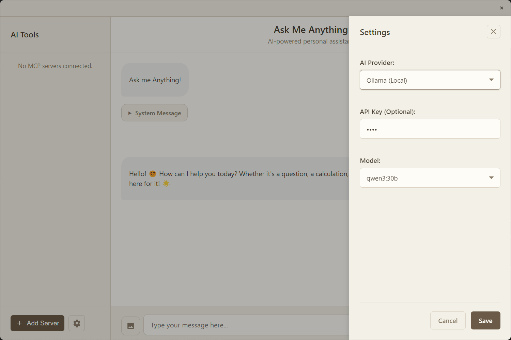

# Ask Me Anything

Chat with any LLM using any framework on major platforms. Use MCP for tools.

## ✨ Features

- **🤖 LLM Framework Integration:** Seamless chat interface with Ollama, MLX, Google/OpenAI/Anthropic (configurable via Settings).
- **🔧 Extensible Tools (MCP):** Connect external tools and data sources via the Model Context Protocol.
  - Supports Python-based MCP servers (added via file path).
  - Supports command-based MCP servers (e.g., Node.js) defined in a JSON configuration file.
- **🖥️ Cross-Platform:** Runs on macOS and Windows (Electron build).
- **📊 Tool Status UI:** Provides visual feedback when AI is calling an MCP tool and whether it succeeded or failed.
- **📝 Markdown & LaTeX Rendering:** Displays AI responses with formatting.

## Screenshots

Startup 
Tool Use 
Model Config 

## Overview

This repository contains both a Python backend and an Electron-based desktop application for interacting with LLMs.

## Project Structure

- **mcp-ai-desktop/**: Frontend Electron application
- **python_backend/**: Python backend server

## Running the Python Backend

### Prerequisites

- Python 3.13+ (as specified in pyproject.toml)
- uv (Modern Python package installer and resolver)

### Setup

1. Install uv if you don't have it already:

   ```bash
   pip install uv
   ```

## Running the Frontend Electron App

### Prerequisites

- Node.js (v16+)
- npm (Node package manager)
- pnpm (Parallel npm - recommended, but not necessary)

### Setup

1. Navigate to the Electron app directory:

   ```bash
   cd mcp-ai-desktop
   ```

2. Install the required dependencies:

   ```bash
   pnpm install
   ```

3. Start the Electron app in development mode:
   ```bash
   pnpm start
   ```

### Building the App

To build the Electron app for your platform:

```bash
cd mcp-ai-desktop
npm run build
```

This will create platform-specific binaries in the `dist` folder.

## Using Pre-built Binaries

If you prefer to use pre-built binaries directly:

1. Navigate to the `mcp-ai-desktop/dist` directory
2. For macOS: Install the `.dmg` file
3. For Windows: Run the `.exe` installer

### Available Binaries

- macOS (Apple Silicon): `MCP AI Chat-0.1.0-arm64.dmg`
- Windows: Check the `dist` folder for `.exe` files

## Example Servers

The repository includes example server implementations in `mcp-ai-desktop/mcp_example_servers/`:

- `mcp_server_calc.py`: Calculator server example
- `mcp_server_weather.py`: Weather information server example

## Troubleshooting

- Ensure uv is installed. Otherwise the backend won't start
- Verify that the required ports are not blocked by a firewall

## License

This project is licensed under the MIT License - see the LICENSE file for details.

## Credits

Original version was [Gemini specific](https://github.com/kkrishnan90/gemini-desktop)

## Contributing

Please raise PR for any contributions. Any PR raised will be reviewed and merged with the main branch.

